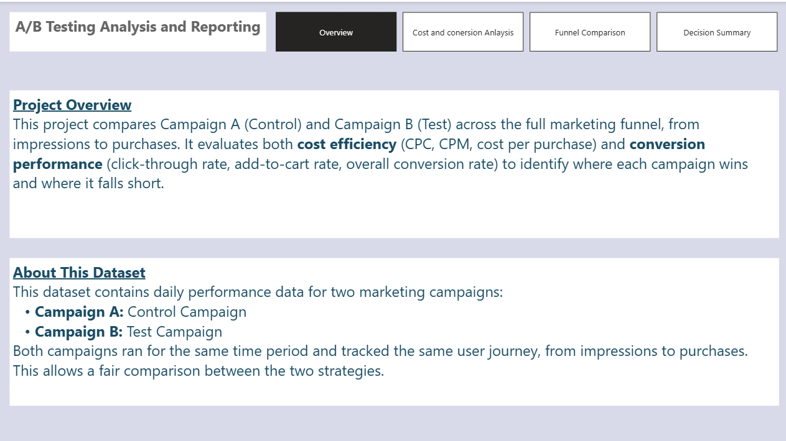
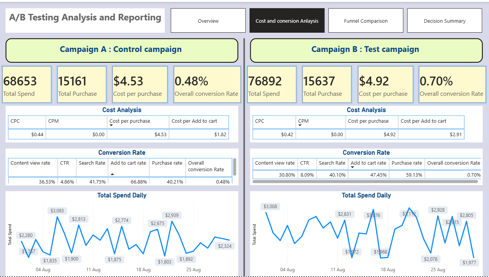
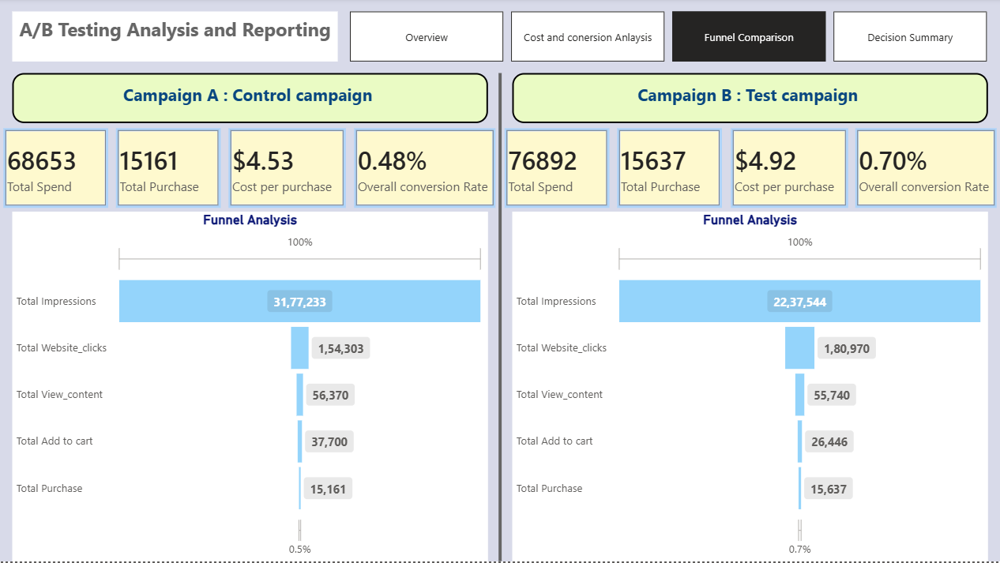
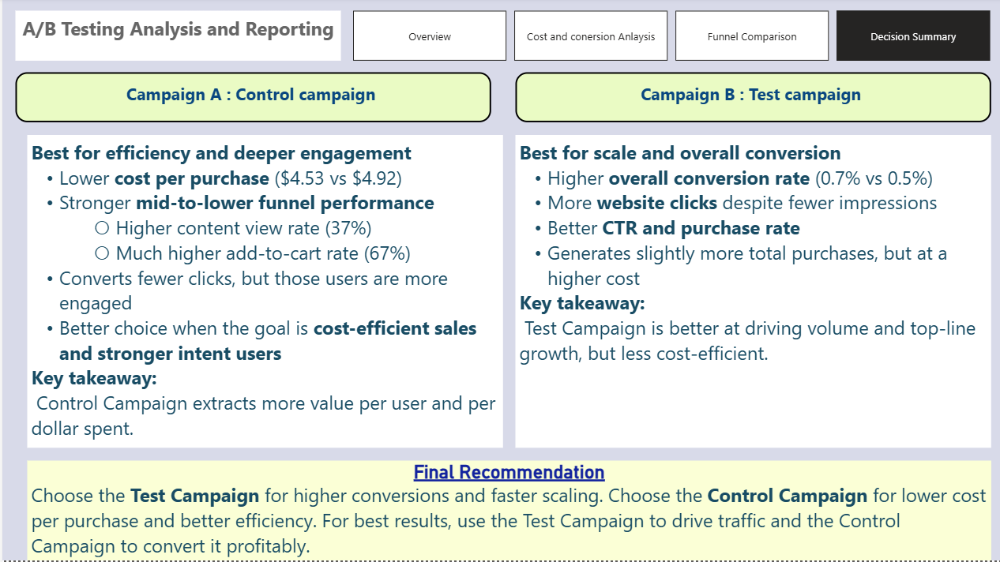

# A/B Testing In Power BI: Marketing Campaign Control vs Test

A Power BI analysis comparing two marketing campaign strategies — Control vs Test — across the full funnel from impressions to purchase, to determine which one actually performs better and why.

## Overview

A/B testing is a method used to compare two strategies to see which one performs better. Both versions are tested under the same conditions, and results are compared using real data — the goal is decisions based on evidence, not assumptions.

Marketing decisions often involve trade-offs between reach, cost, and conversions. This analysis identifies which campaign converts better, which is more cost-efficient, and where users drop off in the funnel.

## Dataset

Daily performance data for two marketing campaigns, run over the same time period and tracking the same user journey — from impressions to purchase:

- **Campaign A:** Control Campaign
- **Campaign B:** Test Campaign

**Funnel stages tracked:** Impressions → Website Clicks → Search → Content Viewed → Added to Cart → Purchase

## Report Pages

| Page | What it shows |
|---|---|
| **Overview** | What A/B testing is, why it matters, and dataset context |
|  |
| **Funnel Comparison** | Side-by-side funnel visuals for Control vs Test, plus spend/purchases/conversion summary cards |
|  |
| **Cost & Conversion Analysis** | CPC, CPM, cost-per-purchase, cost-per-add-to-cart, stage-by-stage conversion rate tables, and daily spend trend |
|  |
| **Decision Summary** | Head-to-head takeaways and final recommendation |
|  |

## Key Metrics (DAX Measures)

Volume: Total Impressions, Total Website Clicks, Total Content Viewed, Total Added to Cart, Total Purchases, Total Spend
Efficiency: CPC, CPM, Cost per Purchase, Cost per Add to Cart
Rates: CTR, Search Rate, Content View Rate, Add to Cart Rate, Purchase Rate, Overall Conversion Rate

## Findings

**Control Campaign** — best for efficiency and deeper engagement:
- Lower cost per purchase ($4.53 vs $4.92)
- Higher content view rate (37%)
- Much higher add-to-cart rate (67%)
- Converts fewer clicks, but those users are more engaged
- **Key takeaway:** extracts more value per user and per dollar spent

**Test Campaign** — best for scale and overall conversion:
- Higher overall conversion rate (0.7% vs 0.5%)
- More website clicks despite fewer impressions
- Better CTR and purchase rate
- Generates slightly more total purchases, but at a higher cost
- **Key takeaway:** drives volume and top-line growth, but is less cost-efficient

## Recommendation

Choose the **Test Campaign** for higher conversions and faster scaling. Choose the **Control Campaign** for lower cost per purchase and better efficiency. For best results: use the **Test Campaign** to drive traffic, and the **Control Campaign** to convert it profitably.

## Tools

Power BI Desktop · DAX (custom measures via a dedicated `_Measures` table)

## Author

Rahi — [github.com/rahii19](https://github.com/rahii19)
